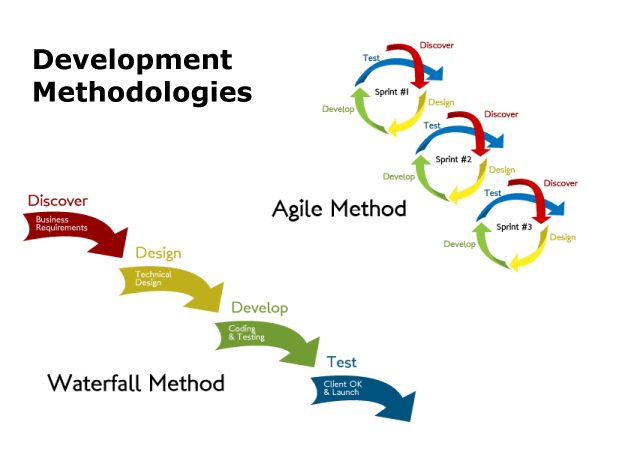

# Interview Questions

## Agile Manifesto

1. What is Agile Methodology?

>**Answer:**
>Agile is a process by which a team can manage a project by breaking it up into several stages and involving constant collaboration with stakeholders and continuous improvement and iteration at every stage. The Agile methodology begins with clients describing how the end product will be used and what problem it will solve. This clarifies the customer's expectations to the project team. Once the work begins, teams cycle through a process of planning, executing, and evaluating — which might just change the final deliverable to fit the customer's needs better. Continuous collaboration is key, both among team members and with project stakeholders, to make fully-informed decisions.
>

2. What is the difference between Waterfall and Agile?

>**Answer:**
>In agile methodology, features of the software are delivered frequently, so that the testing activity is done simultaneously with the development activity. Testing time is shortened as only small features are need be tasted at once.
>
>While, in the waterfall model, testing activities take place at the end of the entire development process. Testing time, in this case, is as long as the entire product is to be tested in one go. Waterfall methodology is a closed process where all stakeholders are not involved in the development process whereas agile methodology requires the involvement of various stakeholders including customers.
>
>

3. What is User Story?

>**Answer:**
>User stories are short, simple descriptions of a feature told from the perspective of the person who desires the new capability, usually a user or customer of the system. They typically follow a simple template:
>
>"As a < type of user >, I want < some goal > so that < some reason >."
>
>A user story is the smallest unit of work in an agile framework. It’s an end goal, not a feature, expressed from the software user’s perspective.
>
>The purpose of a user story is to articulate how a piece of work will deliver a particular value back to the customer. Note that "customers" don't have to be external end users in the traditional sense, they can also be internal customers or colleagues within your organization who depend on your team.
>

4. How do we estimate a User Story?

>**Answer:**
>There are 2 the most popular metrics: __story points__ and __ideal days__.
>
>A __story point__ is a metric used in agile project management and development to estimate the difficulty of implementing a given user story, which is an abstract measure of effort required to implement it. In simple terms, a story point is a number that tells the team about the difficulty level of the story. 
>
>An __ideal day__ is unit for estimating the size of product backlog items based on how long an item would take to complete if it were the only work being performed, there were no interruptions, and all resources necessary to complete the work were immediately available.
>

## Agile Methodologies

1. What is Scrum framework?

>**Answer:**
>Scrum is a framework within which people can address complex adaptive problems, while productively and creatively delivering products of the highest possible value.
>
>Scrum itself is a simple framework for effective team collaboration on complex products.  Scrum co-creators Ken Schwaber and Jeff Sutherland have written The Scrum Guide to explain Scrum clearly and succinctly.  This Guide contains the definition of Scrum. This definition consists of Scrum’s roles, events, artifacts, and the rules that bind them together. 
>
>Scrum is:
>
>* Lightweight
>* Simple to understand
>* Difficult to master
>

2. Which roles exist within a Scrum framework?

>**Answer:**
>The Scrum Team consists of a Product Owner, the Development Team, and a Scrum Master.
>

3. What is Kanban?

>**Answer:**
>Kanban is a method for managing the creation of products with an emphasis on continual delivery while not overburdening the development team. Like Scrum, Kanban is a process designed to help teams work together more effectively. 
>
>Kanban is based on 3 basic principles:
>* __Visualize what you do today (workflow)__: seeing all the items in context of each other can be very informative
>* __Limit the amount of work in progress (WIP)__: this helps balance the flow-based approach so teams don€™t start and commit to too much work at once
>* __Enhance flow__: when something is finished, the next highest thing from the backlog is pulled into play
Kanban promotes continuous collaboration and encourages active, ongoing learning and improving by defining the best possible team workflow. 
>

**[⬆ back to top](#interview-questions)**

