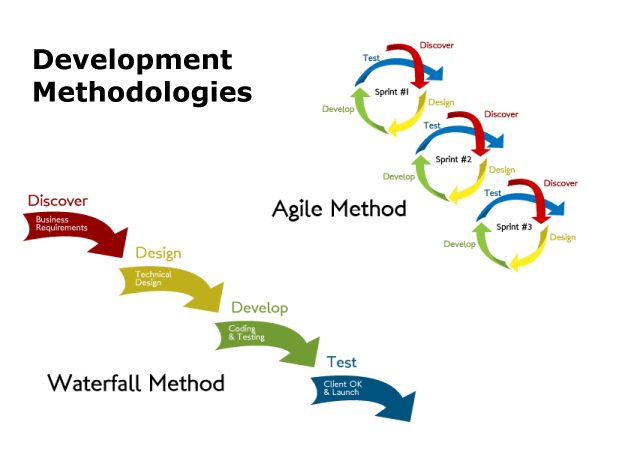
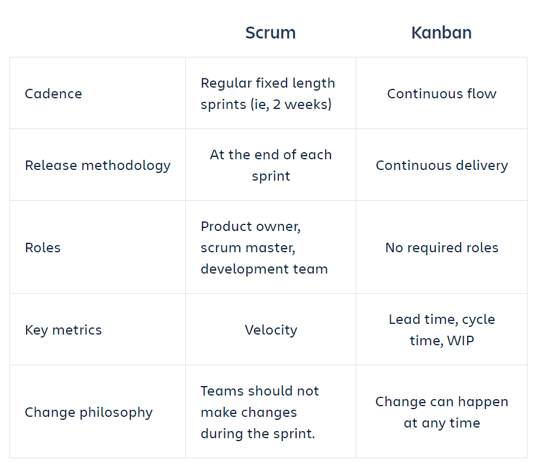

# Exam questions

## Agile Manifesto

1. What is Scrum framework?

>**Answer:**
>Scrum is a framework within which people can address complex adaptive problems, while productively and creatively delivering products of the highest possible value.
>
>Scrum itself is a simple framework for effective team collaboration on complex products.  Scrum co-creators Ken Schwaber and Jeff Sutherland have written The Scrum Guide to explain Scrum clearly and succinctly.  This Guide contains the definition of Scrum. This definition consists of Scrum’s roles, events, artifacts, and the rules that bind them together. 
>
>Scrum is:
>
>* Lightweight
>* Simple to understand
>* Difficult to master
>

2. Which roles exist within a Scrum framework?

>**Answer:**
>The Scrum Team consists of a Product Owner, the Development Team, and a Scrum Master.
>

3. What is Kanban?

>**Answer:**
>Kanban is a method for managing the creation of products with an emphasis on continual delivery while not overburdening the development team. Like Scrum, Kanban is a process designed to help teams work together more effectively. 
>
>Kanban is based on 3 basic principles:
>* __Visualize what you do today (workflow)__: seeing all the items in context of each other can be very informative
>* __Limit the amount of work in progress (WIP)__: this helps balance the flow-based approach so teams don€™t start and commit to too much work at once
>* __Enhance flow__: when something is finished, the next highest thing from the backlog is pulled into play
Kanban promotes continuous collaboration and encourages active, ongoing learning and improving by defining the best possible team workflow. 
>

4. What is Agile Methodology?

>**Answer:**
>Agile is a process by which a team can manage a project by breaking it up into several stages and involving constant collaboration with stakeholders and continuous improvement and iteration at every stage. The Agile methodology begins with clients describing how the end product will be used and what problem it will solve. This clarifies the customer's expectations to the project team. Once the work begins, teams cycle through a process of planning, executing, and evaluating — which might just change the final deliverable to fit the customer's needs better. Continuous collaboration is key, both among team members and with project stakeholders, to make fully-informed decisions.
>

6. What is the difference between Waterfall and Agile?

>**Answer:**
>In agile methodology, features of the software are delivered frequently, so that the testing activity is done simultaneously with the development activity. Testing time is shortened as only small features are need be tasted at once.
>
>While, in the waterfall model, testing activities take place at the end of the entire development process. Testing time, in this case, is as long as the entire product is to be tested in one go. Waterfall methodology is a closed process where all stakeholders are not involved in the development process whereas agile methodology requires the involvement of various stakeholders including customers.
>
>

7. What is User Story?

>**Answer:**
>User stories are short, simple descriptions of a feature told from the perspective of the person who desires the new capability, usually a user or customer of the system. They typically follow a simple template:
>
>"As a < type of user >, I want < some goal > so that < some reason >."
>
>A user story is the smallest unit of work in an agile framework. It’s an end goal, not a feature, expressed from the software user’s perspective.
>
>The purpose of a user story is to articulate how a piece of work will deliver a particular value back to the customer. Note that "customers" don't have to be external end users in the traditional sense, they can also be internal customers or colleagues within your organization who depend on your team.
>

8. How do we estimate a User Story?

>**Answer:**
>There are 2 the most popular metrics: __story points__ and __ideal days__.
>
>A __story point__ is a metric used in agile project management and development to estimate the difficulty of implementing a given user story, which is an abstract measure of effort required to implement it. In simple terms, a story point is a number that tells the team about the difficulty level of the story. 
>
>An __ideal day__ is unit for estimating the size of product backlog items based on how long an item would take to complete if it were the only work being performed, there were no interruptions, and all resources necessary to complete the work were immediately available.
>

## Agile Methodologies

1. What are the Scrum events?

>**Answer:**
>Prescribed events are used in Scrum to create regularity and to minimize the need for meetings not defined in Scrum. All events are time-boxed. Once a Sprint begins, its duration is fixed and cannot be shortened or lengthened. The remaining events may end whenever the purpose of the event is achieved, ensuring an appropriate amount of time is spent without allowing waste in the process.  The Scrum Events are:
>
>* Sprint
>* Sprint Planning
>* Daily Scrum
>* Sprint Review
>* Sprint Retrospective
>

2. What is sprint in Scrum?

>**Answer:**
>As described in the Scrum Guide, a Sprint, a time-box of one month or less during which a “Done”, useable, and potentially releasable product Increment is created. Sprints have consistent durations throughout a development effort. A new Sprint starts immediately after the conclusion of the previous Sprint.
>
>Each Sprint may be considered a project with no more than a one-month horizon. Like projects, Sprints are used to accomplish something. Each Sprint has a goal of what is to be built, a design and flexible plan that will guide building it, the work, and the resultant product increment.
>

3. What is the Sprint Planning?

>**Answer:**
>As described in the Scrum Guide, is the work to be performed in the Sprint is planned at the Sprint Planning. This plan is created by the collaborative work of the entire Scrum Team.
>
>Sprint Planning is time-boxed to a maximum of eight hours for a one-month Sprint. For shorter Sprints, the event is usually shorter. The Scrum Master ensures that the event takes place and that attendants understand its purpose. The Scrum Master teaches the Scrum Team to keep it within the time-box.
>
>Sprint Planning answers the following:
>
>* What can be delivered in the Increment resulting from the upcoming Sprint?
>* How will the work needed to deliver the Increment be achieved?
>

4. What is the Daily Scrum?

>**Answer:**
>As described in the Scrum Guide, the Daily Scrum is a 15-minute time-boxed event for the Development Team to synchronize activities and create a plan for the next 24 hours. The Daily Scrum is held every day of the Sprint. At it, the Development Team plans work for the next 24 hours. This optimizes team collaboration and performance by inspecting the work since the last Daily Scrum and forecasting upcoming Sprint work. The Daily Scrum is held at the same time and place each day to reduce complexity.
>

5. What is the Sprint Review?

>**Answer:**
>As described in the Scrum Guide, a Sprint Review is held at the end of the Sprint to inspect the Increment and adapt the Product Backlog if needed. There could have been a single deployment or many deployments during a Sprint which lead up to that Increment to be inspected.  
>
>During the Sprint Review, the Scrum Team and stakeholders collaborate about what was done in the Sprint. Based on that and any changes to the Product Backlog during the Sprint, attendees collaborate on the next things that could be done to optimize value. This is an informal meeting, not a status meeting, and the presentation of the Increment is intended to elicit feedback and foster collaboration.
>
>This is at most a four-hour meeting for one-month Sprints. For shorter Sprints, the event is usually shorter. The Scrum Master ensures that the event takes place and that attendees understand its purpose. The Scrum Master teaches everyone involved to keep it within the time-box.
>
>The Sprint Review includes the following elements:
>
>* Attendees include the Scrum Team and key stakeholders invited by the Product Owner;
>* The Product Owner explains what Product Backlog items have been “Done” and what has not been “Done”;
>* The Development Team discusses what went well during the Sprint, what problems it ran into, and how those problems were solved;
>* The Development Team demonstrates the work that it has “Done” and answers questions about the Increment;
>* The Product Owner discusses the Product Backlog as it stands. He or she projects likely target and delivery dates based on progress to date (if needed);
>* The entire group collaborates on what to do next, so that the Sprint Review provides valuable input to subsequent Sprint Planning;
>* Review of how the marketplace or potential use of the product might have changed what is the most valuable thing to do next; and,
>* Review of the timeline, budget, potential capabilities, and marketplace for the next anticipated releases of functionality and capability of the product.
>* The result of the Sprint Review is a revised Product Backlog that defines the probable Product Backlog items for the next Sprint. The Product Backlog may also be adjusted overall to meet new opportunities.
>

6. What is the Sprint Retrospective?

>**Answer:**
>As described in the Scrum Guide, the Sprint Retrospective is an opportunity for the Scrum Team to inspect itself and create a plan for improvements to be enacted during the next Sprint.
>
>Typical Sprint Retrospective occurs after the Sprint Review and prior to the next Sprint Planning. This is at most a three-hour meeting for one-month Sprints. For shorter Sprints, the event is usually shorter. The Scrum Master ensures that the event takes place and that attendants understand its purpose. This is the opportunity for the Scrum Team to improve and all member should be in attendance.
>
>During the Sprint Retrospective, the team discusses:
>
>* What went well in the Sprint
>* What could be improved
>* What will we commit to improve in the next Sprint
>
>The Scrum Master encourages the Scrum Team to improve its development process and practices to make it more effective and enjoyable for the next Sprint. During each Sprint Retrospective, the Scrum Team plans ways to increase product quality by improving work processes or adapting the definition of “Done” if appropriate and not in conflict with product or organizational standards.
>
>By the end of the Sprint Retrospective, the Scrum Team should have identified improvements that it will implement in the next Sprint. Implementing these improvements in the next Sprint is the adaptation to the inspection of the Scrum Team itself. Although improvements may be implemented at any time, the Sprint Retrospective provides a formal opportunity to focus on inspection and adaptation.

7. What are the Scrum artifacts?

>**Answer:**
>Scrum’s artifacts represent work or value to provide transparency and opportunities for inspection and adaptation. Artifacts defined by Scrum are specifically designed to maximize transparency of key information so that everybody has the same understanding of the artifact. The Scrum Artifacts are:
>
>* Product Backlog
>* Sprint Backlog
>* Increment
>

8. What is the Product Backlog?

>**Answer:**
>As described in the Scrum Guide, the Product Backlog is an ordered list of everything that is known to be needed in the product. It is the single source of requirements for any changes to be made to the product. The Product Owner is responsible for the Product Backlog, including its content, availability, and ordering.
>
>A Product Backlog is never complete. The earliest development of it lays out the initially known and best-understood requirements. The Product Backlog evolves as the product and the environment in which it will be used evolves. The Product Backlog is dynamic; it constantly changes to identify what the product needs to be appropriate, competitive, and useful. If a product exists, its Product Backlog also exists.
>
>Product Backlog refinement is the act of adding detail, estimates, and order to items in the Product Backlog. This is an ongoing process in which the Product Owner and the Development Team collaborate on the details of Product Backlog items. During Product Backlog refinement, items are reviewed and revised.
>

9. What is the Sprint Backlog?

>**Answer:**
>As described in the Scrum Guide, the Sprint Backlog is the set of Product Backlog items selected for the Sprint, plus a plan for delivering the product Increment and realizing the Sprint Goal. The Sprint Backlog is a forecast by the Development Team about what functionality will be in the next Increment and the work needed to deliver that functionality into a “Done” Increment.
>
>The Sprint Backlog makes visible all the work that the Development Team identifies as necessary to meet the Sprint Goal. To ensure continuous improvement, it includes at least one high priority process improvement identified in the previous Retrospective meeting.
>
>The Sprint Backlog is a plan with enough detail that changes in progress can be understood in the Daily Scrum. The Development Team modifies the Sprint Backlog throughout the Sprint.  Only the Development Team can change its Sprint Backlog during a Sprint. The Sprint Backlog is a highly visible, real-time picture of the work that the Development Team plans to accomplish during the Sprint, and it belongs solely to the Development Team.
>

10. What is the Increment?

>**Answer:**
>As described in the Scrum Guide, an Increment is the sum of all the Product Backlog items completed during a Sprint and the value of the increments of all previous Sprints. At the end of a Sprint, the new Increment must be “Done,” which means it must be in useable condition and meet the Scrum Team’s definition of “Done.”  An increment is a body of inspectable, "Done" work that supports empiricism at the end of the Sprint.  The increment is a step toward a vision or goal.  The increment must be in usable condition regardless of whether the Product Owner decides to release it.
>
>The entire point of Scrum is to deliver a "Done" increment.
>

11. What is the role of the Scrum Master?

>**Answer:**
>The Scrum Master is the leader and supervisor of the Scrum team. The main job of the Scrum Master is to ensure that the team abides by the Agile values and principles and follows the agreed-upon processes and practices. Some of the most crucial responsibilities of the Scrum Master are:
>
>* To eliminate all the obstacles that could hamper the productivity of the Scrum team.
>* To establish a productive and collaborative work environment for the Scrum team.
>* To protect the team from the interruptions and distractions of the outside world.
>* To maintain a good relationship between the team, clients, and all the other stakeholders involved in a project. 
>* To supervise the operations of the Scrum team and motivating them as and when needed. 
>

12. What is the role of the Product Owner?

>**Answer:**
>As described in the Scrum Guide, a Scrum Product Owner is responsible for maximizing the value of the product resulting from the work of the Development Team. How this is done may vary widely across organizations, Scrum Teams, and individuals.
>
>The Product Owner is the sole person responsible for managing the Product Backlog. Product Backlog management includes:
>
>* Clearly expressing Product Backlog items.
>* Ordering the items in the Product Backlog to best achieve goals and missions.
>* Optimizing the value of the work the Development Team performs.
>* Ensuring that the Product Backlog is visible, transparent, and clear to all, and shows what the Scrum Team will work on next.
>* Ensuring the Development Team understands items in the Product Backlog to the level needed.
>
>The Product Owner may do the above work, or have the Development Team do it. However, the Product Owner remains accountable.
>

13. What is the role of the Development Team?

>**Answer:**
>As described in the Scrum Guide, a Scrum Development Team consists of professionals who do the work of delivering a potentially releasable Increment of “Done” product at the end of each Sprint. A "Done" increment is required at the Sprint Review. Only members of the Development Team create the Increment.
>
>Development Teams are structured and empowered by the organization to organize and manage their own work. The resulting synergy optimizes the Development Team’s overall efficiency and effectiveness.
>
>Development Teams have the following characteristics:
>
>* They are self-organizing. No one (not even the Scrum Master) tells the Development Team how to turn Product Backlog into Increments of potentially releasable functionality;
>* Development Teams are cross-functional, with all the skills as a team necessary to create a product Increment;
>* Scrum recognizes no titles for Development Team members, regardless of the work being performed by the person; 
>* Scrum recognizes no sub-teams in the Development Team, regardless of domains that need to be addressed like testing, architecture, operations or business analysis; and,
>* Individual Development Team members may have specialized skills and areas of focus, but accountability belongs to the Development Team as a whole.

14. What is the difference between Scrum and Kanban?

>**Answer:**
>

15. What is a kanban board?

>**Answer:**
>A kanban board is an agile project management tool designed to help visualize work, limit work-in-progress, and maximize efficiency (or flow). Kanban boards use cards, columns, and continuous improvement to help technology and service teams commit to the right amount of work, and get it done!

16. What is WIP limit?

>**Answer:**
>WIP limits are the maximum number of cards that can be in one column at any given time. A column with a WIP limit of three cannot have more than three cards in it. When the column is “maxed-out” the team needs to swarm on those cards and move them forward before new cards can move into that stage of the workflow. These WIP limits are critical for exposing bottlenecks in the workflow and maximizing flow. WIP limits give you an early warning sign that you committed to too much work.

17. What is Kanban card?

>**Answer:**
>The kanban card is an essential component of kanban, a work management framework which helps you visualize your work, limit work in progress (WIP), and maximize efficiency (or flow). Each kanban card represents a single work item as it moves through various stages of completion which are represented on either a physical or virtual kanban board.
>
>To get an idea of what kanban cards are, imagine a software development team using sticky notes on a whiteboard to represent their work items. As they work on bugs and features, the team moves the sticky notes through columns labeled Prioritized, Design, Development, Testing, Blocked, and Done.

18. Explain the release process in Kanban

>**Answer:**
>Kanban tells you more about how to manage the flow of work rather than how to release the work.  However, there are few steps that might be helpful while releasing work or product in Kanban. They are
>
>* Release in Kanban should be every two weeks on a schedule
>* To avoid too many sticky notes in the “done” section, and to run the process smoothly, inform the business unit about releasing the product or work
>* Release the item early which is of high priority and needed immediately

19. What are the 4 principles of Agile?

>**Answer:**
>* Individuals and interactions over processes and tools
>* Working software over comprehensive documentation
>* Customer collaboration over contract negotiation
>* Responding to change over following a plan
>

20.  What are burndown and burn-up charts in agile methodology?

>**Answer:**
>Burn-up and burn-down charts are used to keep track of the progress of the project.
>
>Burn-up charts represent how much work has been completed in any project whereas Burn-down chart represents the remaining work in a project.

21.  What is Velocity?

>**Answer:**
>Velocity is one of the planning tool used to estimate the speed of the work and time of completion of the project. The calculation of velocity is done by reviewing the work team has successfully completed during earlier sprints; for example, if the team completed 5 stories during a two-week sprint and each story was worth 3 story points, then the team’s velocity is 15 story points per sprint.

**[⬆ back to top](#exam-questions)**
