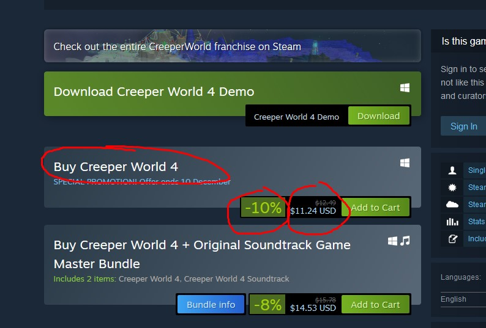

# Using custom test framework

## Short Description

Create steam test, using your test framework

## Estimation (h)

20

## Topics

* Java
* Selenium
* TestNG
* PageObject
* Log4J
* WebdriverManager
* Framework

## Requirements

### Case 1

* Open <https://store.steampowered.com/>
* Login with incorrect credentials
* Assert account invalid dialog

### Case 2

Open main page

Click install steam

Download steam app

Check that file was downloaded

### Case 3

Open main page

Select random game genres

Get three game and save name, price, discount

Find this game using search

Open selected game

Navigate to gave can contains age validation dialog

Compare saved data and data from game page

