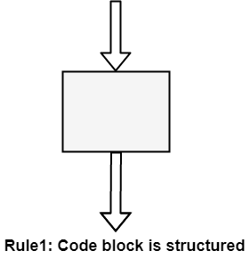
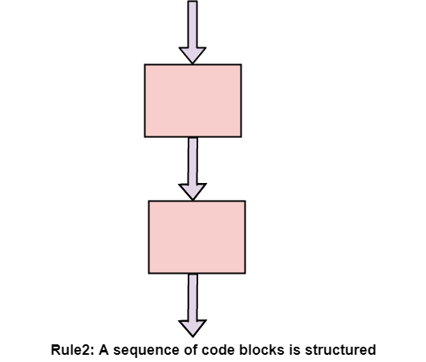
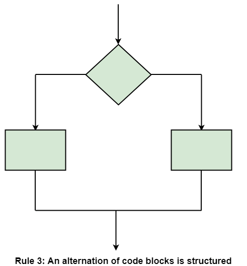
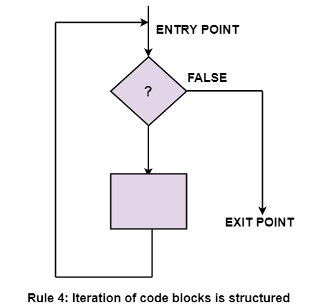
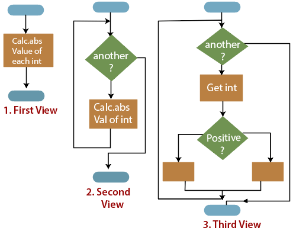

# Exam questions

## Imperative

1. What programming paradigm outlines all the intermediate work steps rather than describing the desired end result?

> **Answer:**
> Imperative programming paradigm

2. What imperative programming paradigms do you know?

> **Answer:**
>
> * Procedural programming
> * Structured programming
> * Object-oriented programming
> * Aspect-oriented programming

3. What are the main features of procedural programming?

> **Answer:**
> A procedural programming is defined as a computer programming that follows, in order, a set of commands. Some of the features of computer procedural programming are:
>
> * Predefined functions: A predefined function is typically an instruction identified by a name. Usually, the predefined functions are built into higher-level programming languages, but they are derived from the library or the registry, rather than the program. One example of a pre-defined function is ‘charAt()’, which searches for a character position in a string.
> * Local Variable: A local variable is a variable that is declared in the main structure of a method and is limited to the local scope it is given. The local variable can only be used in the method it is defined in, and if it were to be used outside the defined method, the code will cease to work.
> * Global Variable: A global variable is a variable which is declared outside every other function defined in the code. Due to this, global variables can be used in all functions, unlike a local variable.
> * Modularity: Modularity is when two dissimilar systems have two different tasks at hand but are grouped together to conclude a larger task first. Every group of systems then would have its own tasks finished one after the other until all tasks are complete.
> * Parameter Passing: Parameter Passing is a mechanism used to pass parameters to functions, subroutines or procedures. Parameter Passing can be done through ‘pass by value’, ‘pass by reference’, ‘pass by result’, ‘pass by value-result’ and ‘pass by the name’.

4. What are advantages and disadvantages of procedural programming?

> **Answer:**
>
> ### Advantages
>
> * Procedural Programming is excellent for general-purpose programming
> * The coded simplicity along with ease of implementation of compilers and interpreters
> * A large variety of books and online course material available on tested algorithms, making it easier to learn along the way
> * The source code is portable, therefore, it can be used to target a different CPU as well
> * The code can be reused in different parts of the program, without the need to copy it
> * Through Procedural Programming technique, the memory requirement also slashes
> * The program flow can be tracked easily
>
> #### Disadvantages
>
> * The program code is harder to write when Procedural Programming is employed
> * The Procedural code is often not reusable, which may pose the need to recreate the code if is needed to use in another application
> * Difficult to relate with real-world objects
> * The importance is given to the operation rather than the data, which might pose issues in some data-sensitive cases
> * The data is exposed to the whole program, making it not so much security friendly

5. What are the main rules of structured programming?

> **Answer:**
>
> * Code Block: A code block is structured
>
> 
>
> * Sequence: Two or more code blocks in the sequence are structured
>
> 
>
> * Alternation: The alternation of two code blocks is structured
>
> 
>
> * Iteration: The iteration of a code block is structured
>
> 
>
> * Nested Structures: A structure (of any size) that has a single entry point and a single exit point is equivalent to a code block
>
> 

6. What are the main principles of object-oriented programming?

> **Answer:**
>
> * Encapsulation
> * Abstraction
> * Inheritance
> * Polymorphism

7. What are the main concepts of aspect-oriented programming?

> **Answer:**
> Aspect
>
> An aspect is the part of the application which cross-cuts the core concerns of multiple objects. An aspect changes the behavior of the rest of the code by applying advice at the join points defined by some pointcut.
>
> * Advice
>
> An advice is the action taken by an aspect at a particular join point. These methods are executed before and / or after the join point is reached.
>
> * Join point
>
> A join point is a point in a program where the advice should be applied.
>
> * Pointcut
>
> The pointcut defines a set of join points which need to be matched before running an advice.
>
> * Introduction
>
> Changing the class structure and / or changing the inheritance hierarchy to add aspect functionality to the code.

## Declarative

1. What programming paradigm is the opposite of imperative?

> **Answer:**
> Declarative programming paradigm

2. What imperative programming paradigms do you know?

> **Answer:**
>
> * Functional programming
> * Logical programming

3. What are the key principles of functional programming?

> **Answer:**
>
> * Pure functions
>
> Pure functions don’t have 'side effects' or actions that don’t relate to the output of the function
>
> * Immutability
>
> Functional programming also prioritizes immutability, or not directly modifying data. Immutability leads to predictability — you know the values of your data, and they aren’t changing. It makes code simple, testable, and able to run on distributed and multi-threaded systems.
>
> * First-class functions
>
> In functional programming, our functions are first-class, which means we can use them like any other value. We can create arrays of functions, pass them as arguments to other functions, and store them in variables.
>
> * Higher-order functions
>
> Higher order functions are functions that do one of two things: they either take a function as one or more of its parameters, or they return a function.
>
> * Function composition
>
> Function composition is when you combine multiple simple functions in order to create more complex ones

4. What is the logical programming?

> **Answer:**
> In logical programming programmers state the relationships between objects rather than giving commands to a computer. The computer can then consider these relationships and arrive at logical conclusions. Generally within a logic program there are two main sets of code - there are facts and rules. Rules are applied to facts to gain knowledge about the environment.

