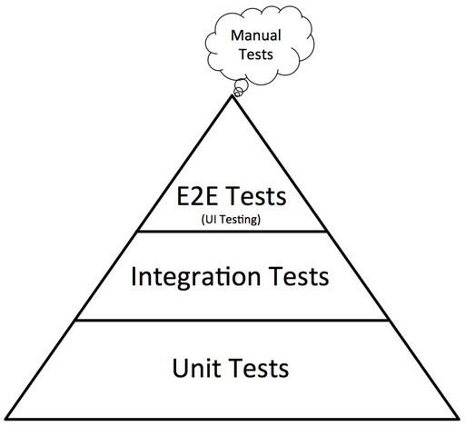
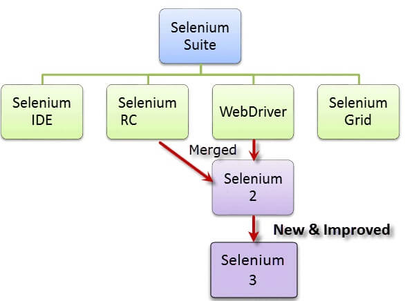
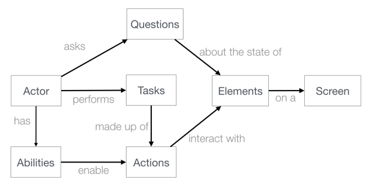

# Interview Questions

## Introduction

1. What is Automation Testing?

>**Answer:**
>Test Automation is a process of automating the manual process to test the application/system under test. Automation testing involves use to a separate testing tool which lets you create test scripts which can be executed repeatedly and doesn’t require any manual intervention.

 

2. What are the purposes of test automation?

>**Answer:**
>Test automation goals and objectives are centered around facilitating the test process and boosting its efficiency.
>Test automation allows to achieve such  goals as :  
>* Increasing speed of executing tests  (test scripts)
>* Increasing the amount of test coverage
>* Shortening software development cycles
>* Reducing maintenance cost of testing 
>* Saving time and money.

3. List the pros and cons of test automation?

>**Answer:**
>Pros of test automation 

>The key benefits of test automation :
>* Faster feedback, earlier detection of defects
>* Faster life cycle.
>* Accurate reports, every time.
>* Reduce required human efforts.
>* Testing efficiency improvement
>* Reduced budget on long run
>* Information Security

>Cons of test automation

>* Proficiency is required to write the automation test scripts.
>* False sense of quality (due to an automated check only checks what is been programmed to check)
>* Not reliable(Automated checks can fail due to many factors)
>* Can not be used with a project that is developed for shorter time period.
>* Initial set up costs (automation tool purchase, training, maintenance of test scripts) are expensive

4. What is Good automated test?

>**Answer:**
>A good test should have below characteristics:

>* It should test only one aspect. If it fails, you know exactly what is wrong.
>* The tests should be granular and independent. 
>* It should be repeatable. Should get same result every time.
>* Should cover sufficient risk. When this test passes, you should be sure that a you can be fairly certain about the application.
>* User-defined messages should be coded or standardized for Error Logging for testers to understand.
>* It shoud have comments and adequate Exception handling (how error is handled on system failure or unexpected behavior of the application).
>* Tests should clean up after themselves.

 
 

  ## Test automation strategy 

5. Which tests are most feasible for automation?

>**Answer:**
>The selection of tests may differ depending on goals of automation. Following are the primary criteria.
>* Repetitive tests that run for multiple builds.
>* Tests that tend to cause human error.
>* Tests that require multiple data sets.
>* Frequently used functionality that introduces high risk conditions(the test case is critical to the business )
>* Tests that are impossible to perform manually.
>* Tests that run on several different hardware or software platforms and configurations.
>* Tests that take a lot of effort and time when manual testing.

  

6. Which types of test cases should you exclude from automation testing?

>**Answer:**
>* Frequently changing tests (when the Application Under Test(AUT) changes frequently)
>* One time test cases
>* Adhoc – Random testing
>* Usability tests which require manual intervention to check for errors or deviation from expected behavior
>* Tests which could return unpredictable results. e.g. time-bound tests, expiry date verification
>* Any tests which require manual intervention 

 

7. What are the main stages in the Automation Testing Lifecycle?

>**Answer:**
>Following are the primary steps to carry out automation testing:
>* Selecting the Automation tool
>* Define the scope of automation testing
>* Planning, design, and development of a test cases and test suites
>* Test execution and reporting
>* Regular maintenance of test suite

  
 

8. What will you consider selecting the Automation tool ?

>**Answer:**
> It is important to choose the automated testing tool that best suits your overall requirements and automation needs.
>The top priorities :
>* Support for your platforms and technology. 
>CI, DevOps support ? Are you testing .Net, C# or WPF applications and on what operating systems? Are you going to test web applications? Do you need support for mobile application testing? Do you work with Android or iOS, or do you work with both operating systems?
>* Licensing and support costs
>* Training, documentation, tutorials, guidelines
>* Level of programming skills required 
>* Create automated tests that are reusable, maintainable and resistant to changes in the applications. 

  

9. What will be the activities during test maintenance?

>**Answer:**
>
>* Bug fixing - bugs are reported because of some scenarios which are not tested at all 
>* Upgrade - Upgrading the application to the newer versions of the Software
>* Enhancement - Adding some new features into the existing software, code refactoring, configure your system for easier testing, identifying the flaky Tests and work on reducing them  

  
 
 

10. What are false positives and false negatives in test automation?

>**Answer:**
>* A false positive is an error in data reporting in which a test result incorrectly indicates the presence of a condition such as a failure when the failure is not present, while a false negative is the opposite error where the test result incorrectly fails to indicate the presence of a condition when it is present.
So, in another words:
>* If the code is broken, but the test passes; that is a false negative.
>* If the code is correct, but the test fails; that is a false positive.

   
 

 

11. What is automation framework?

>**Answer:**
>A framework is a set of the structure of the entire automation suite. It is also a guideline, which if followed can result in a structure that is easy to maintain and enhance.
>These guidelines include: 
>* Rules for writing test cases.
>* Coding guidelines for creating test handlers.
>* Input test data template.
>* Object repository management.
>* Log configuration.
>* Test result and reporting usage

   

12. What different approaches can you use for designing an automation solution?

>**Answer:**
>We can design a test automation solution based on the following types of frameworks.
>* Linear Automation Framework.
>* Module Based Testing Framework
>* Data Driven Testing Framework
>* Keyword Driven Testing Framework
>* Behavior Driven Development Framework
>* Hybrid Testing Framework

 

13. What is Data-Driven Framework?

>**Answer:**
>In Data-Driven Framework the Test Data is separated and kept outside the Test Scripts. Test Data is read from the external files (Excel Files, Text Files, CSV Files, ODBC Sources, DAO Objects, ADO Objects) and are loaded into the variables inside the Test Script. Variables are used both for Input values and for Verification values. .
>Advantages
>* Changes to the Test Scripts do not affect the Test Data
>* Test Cases can be executed with multiple Sets of Data
>* A Variety of Test Scenarios can be executed by just varying the Test Data in the External Data File
>* Disadvantages
>* More time is needed to plan and prepare both Test Scripts and Test Data

 

14. What is BDD?

>**Answer:**
>Behaviour-Driven Development (BDD) is the software development process.
>BDD is a way for software teams to work that closes the gap between business people and technical people by:
>* Encouraging collaboration across roles to build shared understanding of the problem to be solved
>* Working in rapid, small iterations to increase feedback and the flow of value
>* Producing system documentation that is automatically checked against the system’s behaviour

>So BDD uses human-readable descriptions of software user requirements as the basis for software tests. 

  

15. What is BDD Framework?

>**Answer:**
>BDD framework that allows the tester/business analyst to create test cases in simple text language.
>BDD Framework has all those features along with its advantages:
>* Test scenarios are written separately in a different file, named as Feature file.
>* Tests are written by focusing user stories and system behavior in a layman language.
>* Code is subject to be written differently in step definitions file i.e. Java, Python, C#.

  
 

16. What is a test automation pyramid?

>**Answer:**
>The test automation pyramid lays out the types of tests that should be included in an automated test suite.
>The test automation pyramid operates at three levels:

>* Unit tests
>* Integration tests
>* GUI (End-to-End tests)

>

 

17. What is Unit testing?

>**Answer:**
>UNIT TESTING is a level of software testing where individual units/ components of a software are tested. The purpose is to validate that each unit of the software performs as designed. A unit is the smallest testable part of any software. It usually has one or a few inputs and usually a single output.

 

18. What is TDD?

>**Answer:**
>TEST DRIVEN DEVELOPMENT (TDD) approach first, the test is developed which specifies and validates what the code will do. In simple terms, test cases are created before code is written. The purpose of TDD is to make the code clearer, simple and bug-free.

  

19. What is Integration testing?

>**Answer:**
>INTEGRATION TESTING is a level of software testing where individual units are combined and tested as a group. The purpose of this level of testing is to expose faults in the interaction between integrated components.These components can range from databases, external services (APIs) and the like.

   

20. What is API testing?

>**Answer:**
>API testing is a type of software testing that involves testing application programming interfaces (APIs) directly and as part of integration testing to determine if they meet expectations for functionality, reliability, performance, and security.

  

21. What are the Pros and Cons of doing automated testing at the UI layer?

>**Answer:**
>##### Pros.
>* Since UI automation simulates a real-time user, so it is useful for verifying end-to-end UI flows.
>* It could help testing application integration with the external systems.
>* The test suite can also be given to the customer to collect his feedback and gain confidence.
>* Automation tests can provide early feedback on high priority modules and help to reveal severe bugs.
>* Provides the ability to verify UI functionality even when it is not possible to test manually.
>##### Cons.
>* UI automation can break when there are frequent changes in the UI element locators.
>* Test execution is slow as UI actions use a delay in processing.
>* Automation can verify only limited information which is available.
>* You need to cap the volume of test cases executed due to their slowness.
>* Automating a UI test could be time intensive as it involves many steps.

  

22. What to automate firstly - UI or API tests?

>**Answer:**
>Based on pyramid of testing API tests should be automated firstly.

 
 

23. Which test cases will you automate firstly for regression testing?

>**Answer:**
> The tests based on technical and business priority that are necessary for a frequent release cycle.
> It allows the testing team to test the high priority test cases which help to resolve critical bugs earlier in the testing phase.   
>The pyramid of testing should be taken into account as well.

  

24. What is Selenium?

>**Answer:**
>SELENIUM is a free (open-source) automated testing framework used to validate web applications across different browsers and platforms.
>Selenium Software is not just a single tool but a suite of software, each piece catering to different testing needs of an organization. Here is the list of tools:
>* Selenium Integrated Development Environment (IDE)
>* Selenium Remote Control (RC)
>* WebDriver
>* Selenium Grid

>

  

25. What cloud based platform (tools) for cross-browser testing do you know?

>**Answer:**
>The most popular tools:
>* Browser-Stack(desktop and mobile browser)
>* Sauce Labs(web and mobile app testing platform)
>* LambdaTest
>* SeleniumBox

  

26. What is DOM?

>**Answer:**
>The Document Object Model (DOM) is the data representation of the objects that comprise the structure and content of a document on the web. 

  
 
 

27. What are different types of locators in Selenium?

>**Answer:**
>Selenium supports 8 different types of locators:
>* id,
>* name, 
>* className,
>* tagName,
>* linkText,
>* partialLinkText,
>* CSS selector,
>* xpath.

   

28.Which locator is preferable to use?

>**Answer:**
>Using ID Locator in Selenium WebDriver is the fastest and the most reliable among all the locators. ID's are supposed to be unique to each element, making the ID locator as a dependable choice.

    
   

29. What is the primary difference between the XPath and CSS selector?

>**Answer:**
>The primary difference between XPath and CSS Selectors is that, with the XPath we can traverse both forward and backward whereas CSS selector only moves forward.

 

## Test Design Patterns

30. What is Design Pattern?

>**Answer:**
>A design pattern is the re-usable form of a solution to a design problem.

   
 
  

 
31. Which Test Design Patterns in Automation Testing do you know?

>**Answer:**
>The most popular Test Design Patterns are:
>* Page Objects pattern
>* Page Factory pattern
>* Screenplay Pattern
>* Fluent / Chain of Invocations
>* Presenter First
>* etc

  

32. What is Page Objects pattern(POM)?

>**Answer:**
>Page Object Model (POM) is a design pattern, popularly used in test automation that creates Object Repository for web UI elements.

>Under this model, for each web page in the application, there should be a corresponding Page Class. This Page class will identify the WebElements of that web page and also contains Page methods which perform operations on those WebElements. Each element is a private property (or getter).  Page methods are public and internally operate with elements. 

>The main problem it solves is the separation of technical details (e.g. user interface elements on the page/screen) and actual test logic of UI test. 

   

33. What are the advantages of using Page Objects pattern?

>**Answer:**
>* Code becomes less and optimized as we are able to reuse page object methods in the POM classes
>* Page Object Pattern says operations and flows in the UI should be separated from verification. This concept makes our code cleaner and easy to understand.
>* Any change in UI can easily be implemented, updated and maintained into the Page Objects and Classes  
>* The object repository is independent of test cases, so we can use the same object repository for a different purpose with different tools. For example, we can integrate POM with TestNG/JUnit for functional Testing and at the same time with JBehave/Cucumber for acceptance testing.

 

34. What is Screenplay Pattern?

>**Answer:**
>The Screenplay Pattern is a user-centred approach to writing the automated acceptance tests. Screenplay uses the idea of actors, tasks and goals to express tests in business terms, rather than in terms of interactions with the system. In Screenplay, you describe tests in terms of an actor who has goals.
The key elements of the pattern are: actors, abilities, interactions, questions, and tasks.

>

    

35. What are the advantages of using Screenplay pattern?

>**Answer:**
>* The screenplay pattern can help you write more readable and maintainable tests.
>* Scalability and ease of maintenance, it makes writing larger test suites for more complicated applications, real-world application significantly easier and faster, it makes it easier to scale, make it easier to bring people on board, train them, etc
>* Living Documentation: it provides great reporting and living documentation.

  

## Metrics 

36. Why are metrics used for in Automation testing?

>**Answer:**
Test metrics can help implement and improve the Organizational test processes and consequently help track its status
>* Take decision for next phase of activities
>* Evidence of the claim or prediction
>* Understand the type of improvement required
>* Take decision or process or technology change

  
 

37. Test automation ROI: how to calculate it?

>**Answer:**
>ROI is calculated as savings gained by replacing manual regression tests with automated tests divided by the cost of investment into test automation:

>ROI = (Savings ÷ Investment) 

>Since ROI is a unitless number, it really doesn’t matter whether the savings and investment amounts are in dollars or time. For ease in calculation, minutes will be used because most of our inputs are in the form of time.

>Cost Savings

>Savings is the difference between the cost of running a set of tests manually versus running the same tests automatically >a number of times over some period.

>Savings = (time to run one manual test case - time to run one automated test case) * # of tests * # of runs

>Test Automation Investment

>Investment is the summation of fixed and ongoing costs of test automation including time spent building and configuring >the test automation tooling or framework, and time spent coding or maintaining automated tests.

>Investment = time to build framework + (time to code one automated test * # of tests) + maintenance costs

    
  

**[⬆ back to top](#interview-questions)**
