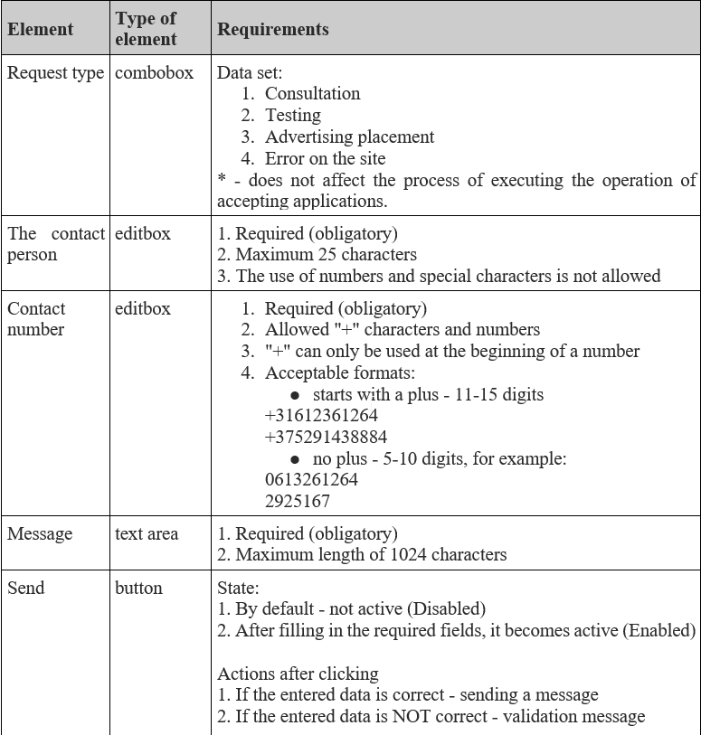
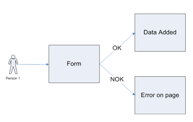

# Applying Different Techniques

## Short Description

Practice Test Case creation using different Test Design techniques.

## Estimation (h)

6

## Topics

* Test Design Techniques
* Test Documentation

## Requirements

### Introductory Conditions

There is the application form with the following requirements:

There is also the Use Case that can help you:

### Task

* Think of as many Test Design Techniques as you can apply for the application
* Create test cases according to all possible Test Design Techniques

### Result

* Test cases
