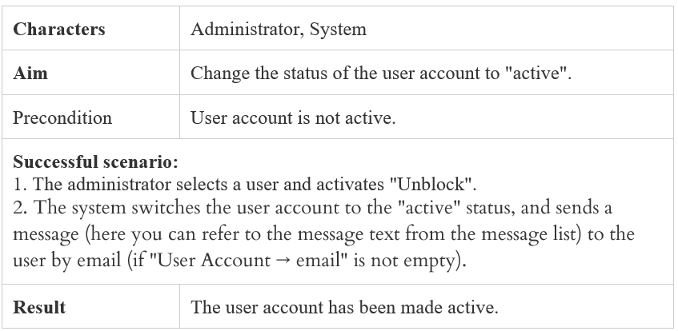

# Use Case Testing

## Short Description

Practice Test Case creation based on Use Case.

## Estimation (h)

3.5

## Topics

* Test Documentation

## Requirements

### Introductory Conditions

There is an example of Use Case "Unlock User Account":

### Task

* Create necessary test cases for a comprehensive verification of this Use Case

### Result

* Test cases
