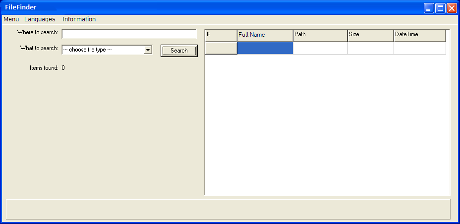

# User and Product Levels Requirements Analysis

## Short Description

Practice analysis of User and Product requirements. It's important skill that help you to define what the software has
to do in order for the users to accomplish their objectives and how the software must be built to enable users to
accomplish their tasks, thereby satisfying the business requirements.

## Estimation (h)

7

## Topics

* Requirements Analysis

## Requirements

### Application Requirements

* FileFinder (FF) should automatically search for files using a given pattern.
* The app should be written for Win 10.
* To search for files user should enter the starting directory (or directory set). User taps "Enter" key or FF
    automatically scans directories for unlimited nesting depth and displays found files on the right panel (see
    screenshot below).
* Three types of files are available for the search. User may enter a file type manually or select is from "What to
    search" combo box.
  * Audio files (mp3, mpg, ogg, wav, mid)
  * Video files (avi, mpeg, and so on)
  * Office files (all formats)
  * Other files
* For each found file the app should display:
  * Name
  * Full path
  * Size
  * Datetime
  * Screenshot with the first frame
* Performance.
  * FF should search for more than 500 files per second (assuming the read/write disc access speed is more than 50
        Mb/sec).
  * If expected overall operation time exceeds 2 hours, the app should not start its work.
* Language support.
  * The app should support German and English languages by default.
  * There should be an option to add new languages.
* Logging.
  * FF should log its work and the logging should stop when the log size exceeds 1 MB.
  * Currently analyzing directory name should be displayed in "Currently analyzing" section at the bottom of the screen.
* File system support.
  * The app should support all file systems available for Windows and MacOS.
  * If an unsupported FS is detected, FF should perform the emergency shutdown.
* There should be network support.

### Task

* Analyze requirements according to properties of quality requirements
* Prepare questions to the customer

### Result

* Email letter with the list of questions
* Mark each question with the properties of quality requirements that you think are violated

## Advanced Requirements

* Answer your questions on behalf of the customer
* Think over if requirements have become clearer and more understandble; if not, reformulate your questions or ask new
    ones
